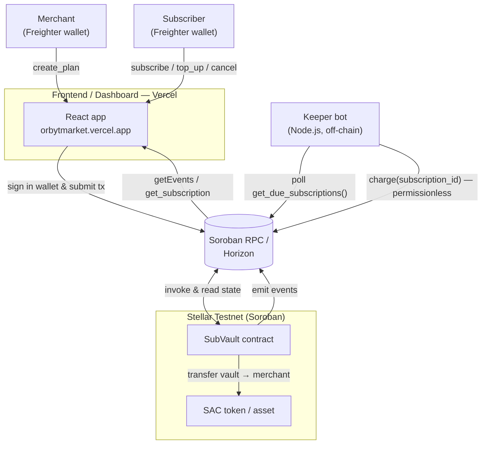
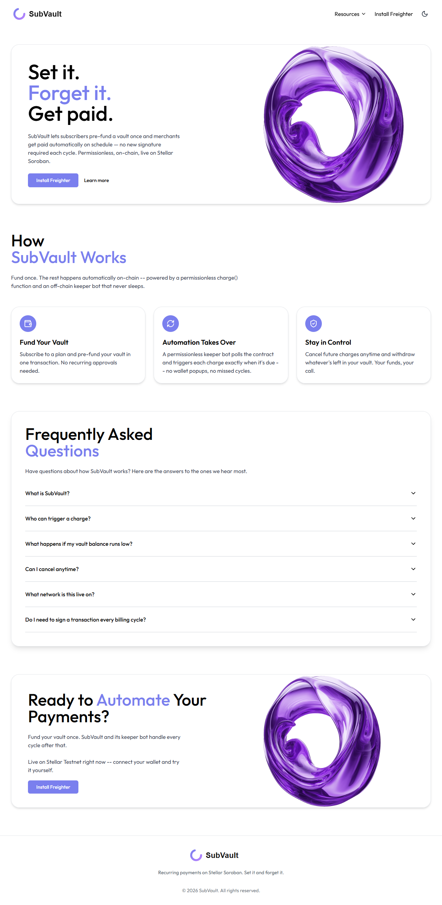
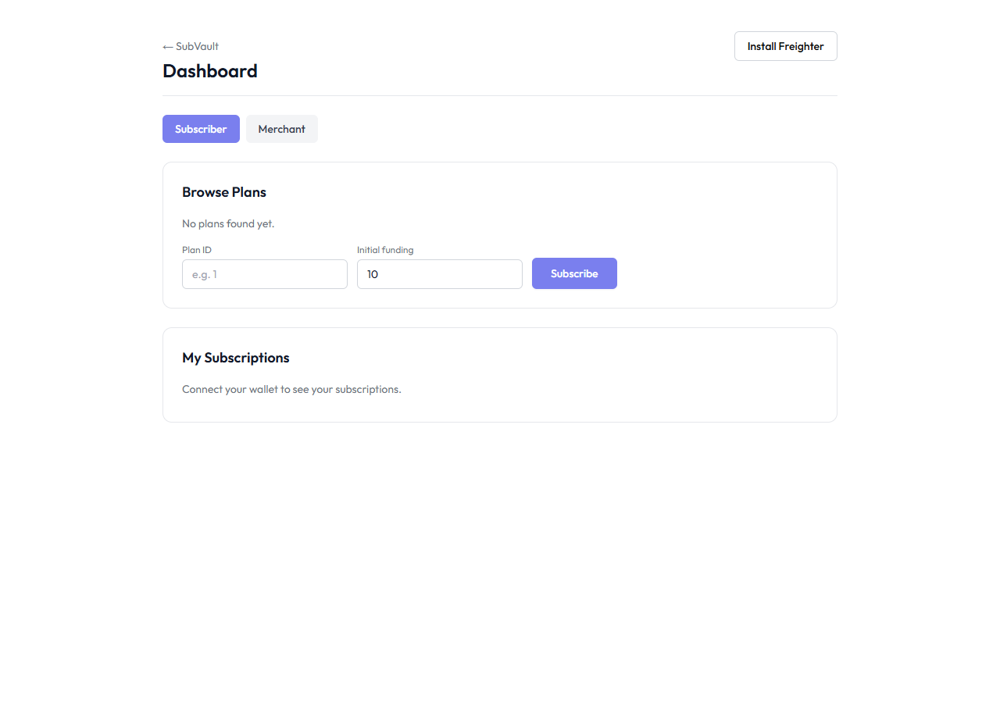
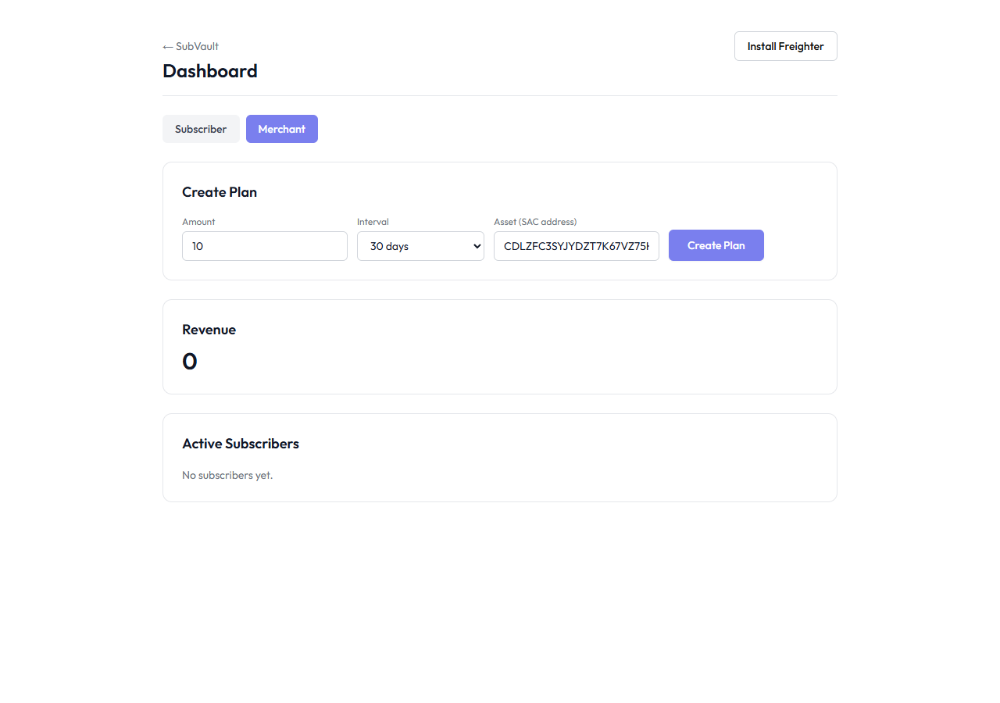
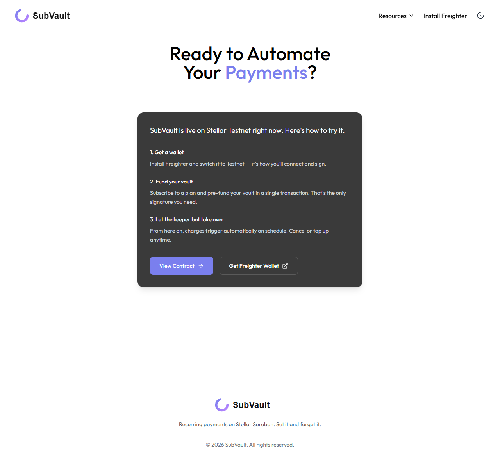
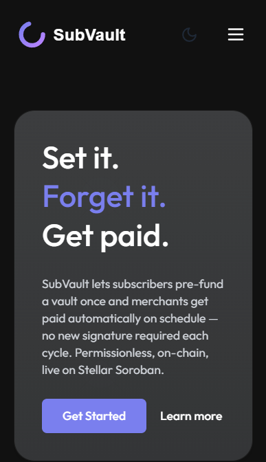
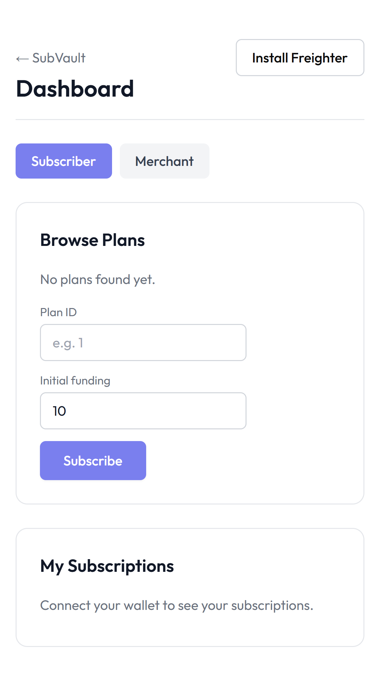
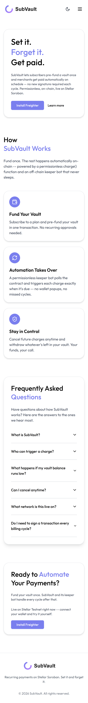

# SubVault

Recurring payments on Stellar Soroban. A subscriber pre-funds a vault once;
a merchant gets paid automatically on a fixed schedule via a permissionless
`charge()` call that an off-chain keeper bot triggers when a cycle is due.

```
contracts/sub_vault/   Soroban contract (Rust)
keeper/                Off-chain keeper bot (Node.js/TypeScript)
frontend/              React app (Subscriber + Merchant views)
scripts/deploy.sh      Testnet deploy script
```

## Submission checklist

| Requirement | Where |
| --- | --- |
| Public GitHub repository | <https://github.com/roynishita203/orbyt> |
| README with setup instructions | [Quick start](#quick-start) |
| 2+ meaningful commits | see the repo commit history |
| Live demo (deployed) | [Live demo](#live-demo) — <https://orbytmarket.vercel.app> |
| Deployed contract address | [Deployment & on-chain proof](#deployment--on-chain-proof) |
| Transaction hash of a contract call (verifiable) | [Deployment & on-chain proof](#transaction-hash-of-a-contract-call) |


## Live demo

Marketing site + dashboard (Stellar **Testnet**): **https://orbytmarket.vercel.app**

- Landing page: <https://orbytmarket.vercel.app>
- App / dashboard: <https://orbytmarket.vercel.app/app>

Requires the [Freighter](https://www.freighter.app/) browser wallet (set to Testnet) to connect and sign.

## Deployment & on-chain proof

Everything below is live on **Stellar Testnet** and verifiable on Stellar Explorer.

| Item | Value |
| --- | --- |
| **Deployed contract address** | `CBP5MBVXH7TVFXV6P6JPYM5D7N53KZPGTHXNGFCCJONAKBLLPYQW5SBI` |
| Payment asset (SAC) | `CDLZFC3SYJYDZT7K67VZ75HPJVIEUVNIXF47ZG2FB2RMQQVU2HHGCYSC` |
| Network | Testnet (`Test SDF Network ; September 2015`) |
| RPC | `https://soroban-testnet.stellar.org` |

- **Contract on Stellar Explorer:** <https://stellar.expert/explorer/testnet/contract/CBP5MBVXH7TVFXV6P6JPYM5D7N53KZPGTHXNGFCCJONAKBLLPYQW5SBI>
- **Contract deployment transaction:** [`035da692…b3e7e`](https://stellar.expert/explorer/testnet/tx/035da69216f8928e41e656146279927b590a4e08ee5ac9b50fd8428c813b3e7e)

### Transaction hash of a contract call

A real `create_plan` invocation of the deployed contract (creates `plan_id 2`, emits `plan_created`):

**`b8091c825c00735d8eb001c74ce609ded872d7f087ce632abff31220a2e93187`**

Verify it on Stellar Explorer: <https://stellar.expert/explorer/testnet/tx/b8091c825c00735d8eb001c74ce609ded872d7f087ce632abff31220a2e93187>

## How it works

1. A merchant calls `create_plan(merchant, amount, interval_secs, asset)` and gets a `plan_id`.
2. A subscriber calls `subscribe(subscriber, plan_id, initial_funding)`, which pulls
   `initial_funding` into the contract's custody. The first charge is due immediately.
3. A keeper bot polls `get_due_subscriptions()` and calls `charge(subscription_id, caller)`
   for anything due.
4. `charge` is **permissionless** -- anyone can call it, including the keeper bot, a
   competing keeper, or the subscriber themselves. The function only actually moves
   funds if the subscription is `Active` and due; the security model lives entirely in
   those checks, not in who is allowed to call the function. If the vault balance is
   insufficient, the subscription flips to `PastDue` instead of partially charging.
5. Subscribers can `top_up` (which also recovers a `PastDue` subscription back to
   `Active`), `cancel_subscription` at any time, and `withdraw_remaining` once cancelled.

See [`SPEC.md`](./SPEC.md) for the full contract interface, error cases, and events.

## System architecture



**Flow:** a merchant registers a plan and a subscriber pre-funds a vault (both sign with
Freighter and submit through the RPC). The off-chain **keeper** polls
`get_due_subscriptions()` and fires the permissionless `charge()` when a cycle is due; the
contract moves funds from the vault to the merchant via the SAC token and emits events. The
frontend replays those events through the RPC to reconstruct live plan/subscription state.

## Screenshots

All captured live from <https://orbytmarket.vercel.app> (Stellar **Testnet**).

### Landing page



### Dashboard — wallet options available

Subscriber view with the wallet connect option (Freighter) in the header.



### Merchant — create a plan



### Get started



### Mobile responsive UI

The app adapts to a mobile viewport — landing page and dashboard:

<p>
  
  
  
</p>

### Wallet-connected flow (capture with your own wallet)

The states below require a connected [Freighter](https://www.freighter.app/) wallet with a
funded testnet account, so they can't be captured headlessly. Drop the PNGs into
[`docs/screenshots/`](docs/screenshots/) using these exact names and they will render here
automatically (see [`docs/screenshots/README.md`](docs/screenshots/README.md) for what each
must show):

- **Wallet connected state** — `01-wallet-connected.png`
- **Balance displayed** — `02-balance-displayed.png`
- **Successful testnet transaction** — `03-testnet-transaction.png`
- **Transaction result shown to the user** — `04-transaction-result.png`

### Additional — uploaded UI screenshot


## Quick start

### 1. Contract

```bash
cargo test -p sub_vault      # unit tests
stellar contract build       # produces target/wasm32v1-none/release/sub_vault.wasm
./scripts/deploy.sh          # deploys to testnet, prints the contract ID
```

### 2. Keeper bot

```bash
cd keeper
cp .env.example .env         # fill in CONTRACT_ID, KEEPER_SECRET_KEY, etc.
npm install
npm test                     # unit tests (mocked contract client)
npm run dev                  # start polling testnet
```

### 3. Frontend

```bash
cd frontend
cp .env.example .env         # fill in VITE_CONTRACT_ID, etc.
npm install
npm run dev                  # http://localhost:5173
```

Requires the [Freighter](https://www.freighter.app/) browser wallet to connect and sign.
